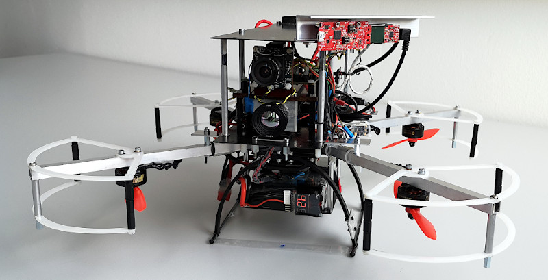
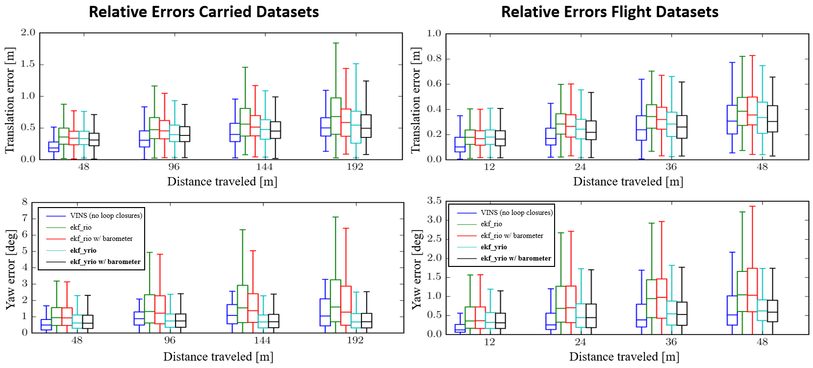
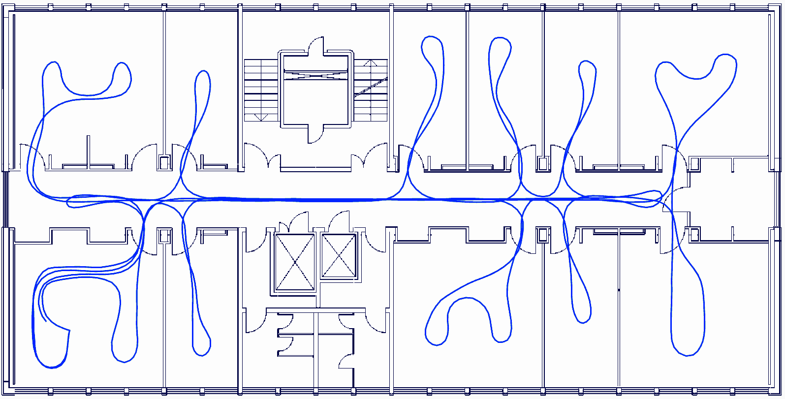
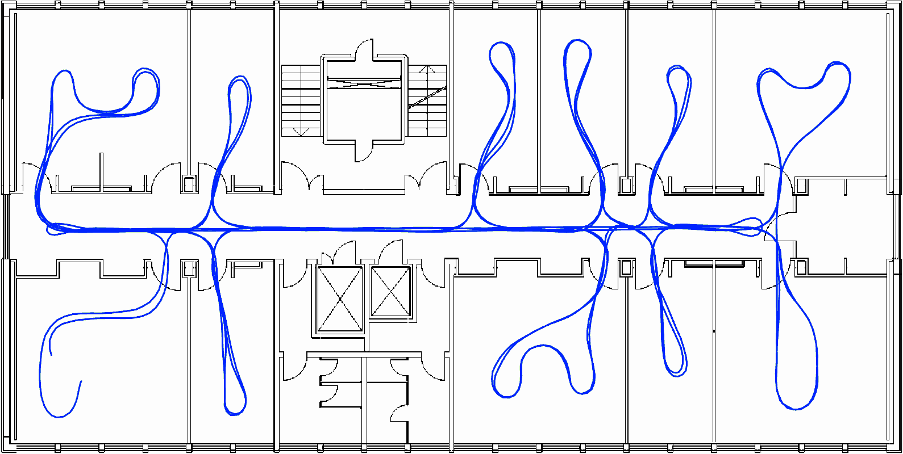
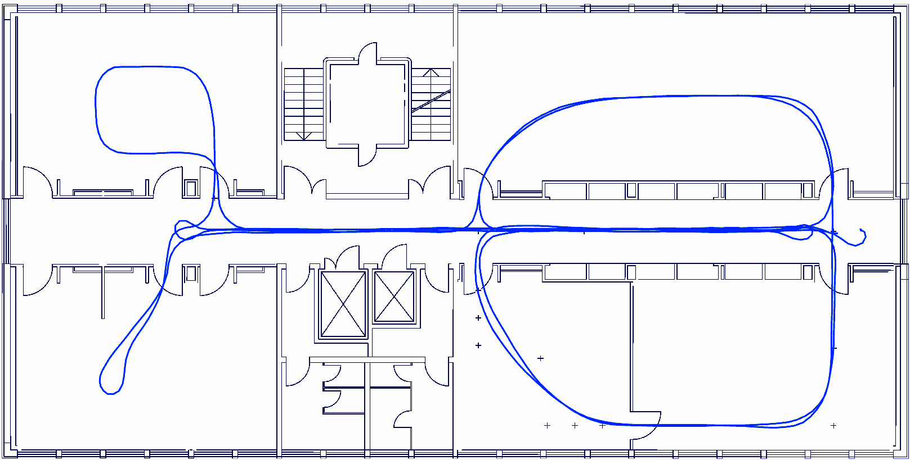
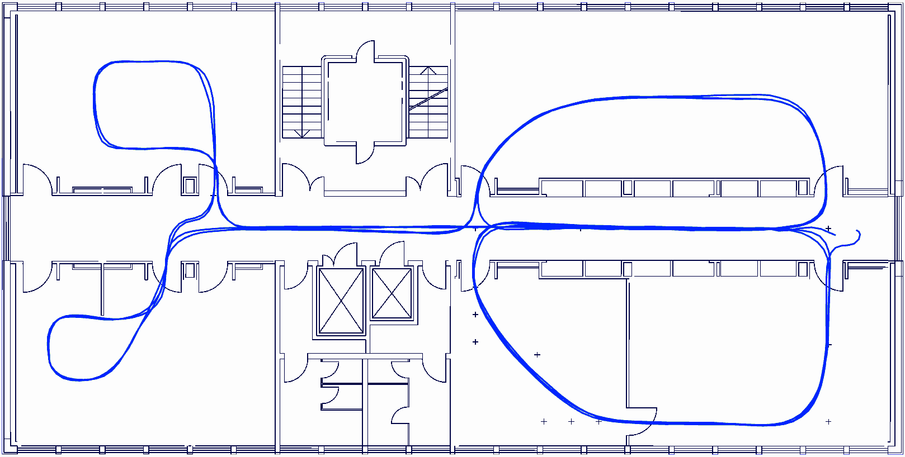
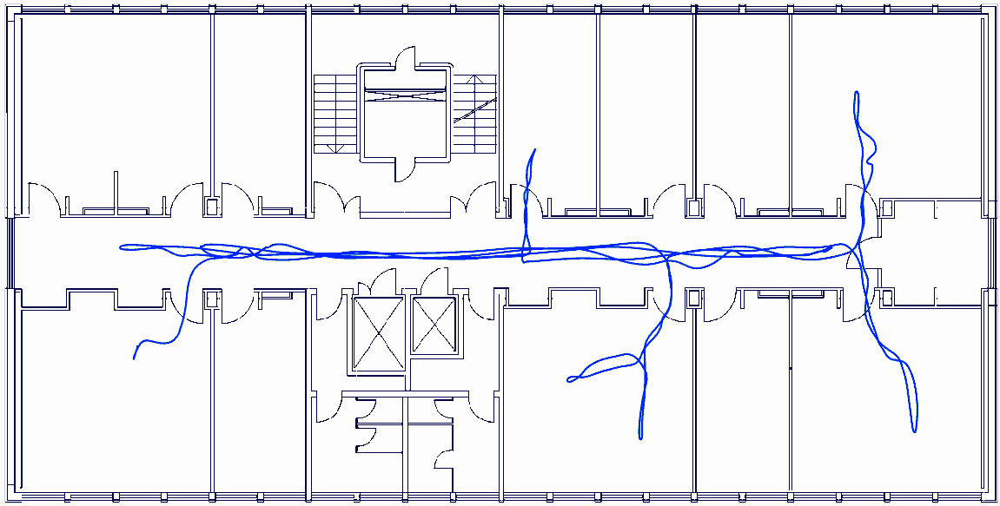
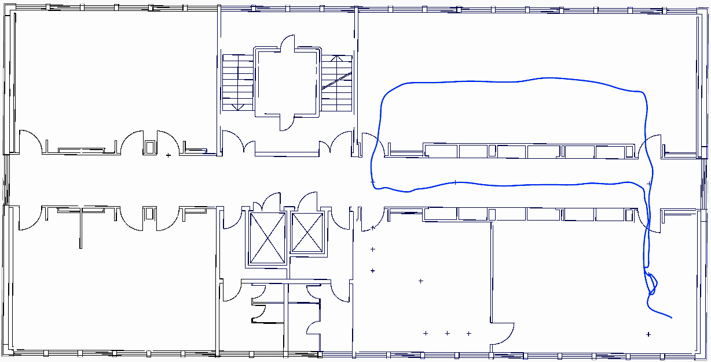
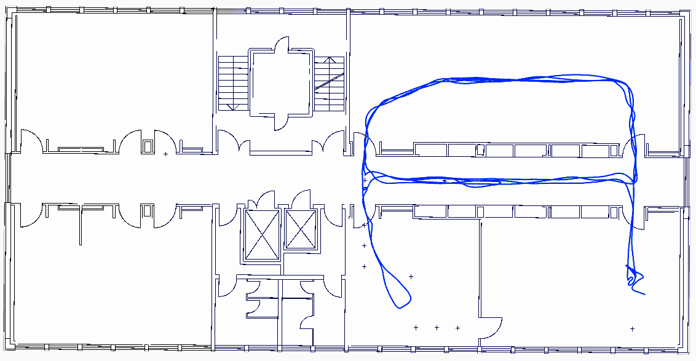
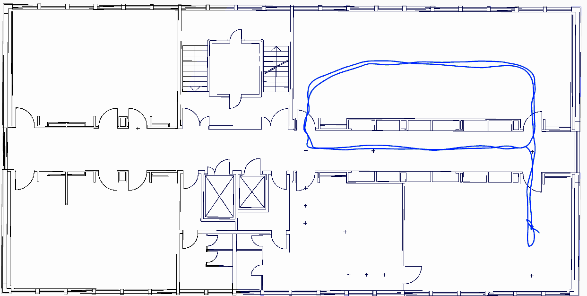

This dataset can be downloaded [here](https://bwsyncandshare.kit.edu/s/wiNRrPNed8dJ64c) and can be processed by our yaw
 aided radar inertial odometry pipeline [ekf_yrio](https://github.com/christopherdoer/rio/tree/main/ekf_yrio).

Contact me in case of questions or issues: [Christopher Doer](mailto:christopher.doer@kit.edu)

The dataset consists of 5 carried and 4 manual flight indoor datasets recorded in an office building.
Pseudo ground truth is available and was created using [VINS](https://github.com/HKUST-Aerial-Robotics/VINS-Fusion)  with loops closure and subsequent manual removal of scale errors.
A short summary of the datasets is given below:

|Name |Trajectory Length  | Duration | Environment |
  --- | --- | --- | ---
|Carried 1| 287m | 273s | Office floor: offices, computer labs, long corridor | 
|Carried 2| 451m | 392s | Office floor: offices, computer labs, long corridor|
|Carried 3| 235m | 171s | Office floor: labs, meeting room, long corridor|
|Carried 4| 311m | 220s | Office floor: labs, meeting room, long corridor|
|Carried 5| 228m | 172s | Basement: workshop, long corridor |
|Manual Flight 1| 147m | 180s | Office floor: furnished offices, computer labs, long corridor |
|Manual Flight 2| 49m  | 75s | Office floor: labs, long corridor|
|Manual Flight 3| 149m | 178s | Office floor: labs, long corridor|
|Manual Flight 4| 79m | 110s | Office floor: labs, long corridor|

# Cite
If you use this dataset for your academic research, please cite our related paper:
~~~bibtex
@INPROCEEDINGS{DoerICINS2021,
  author={Doer, Christopher and Trommer, Gert F.},
  booktitle={2021 28th Saint Petersburg International Conference on Integrated Navigation Systems (ICINS)}, 
  title={Yaw aided Radar Inertial Odometry uisng Manhattan World Assumptions}, 
  year={2021}
}
~~~

# Known Issues
- The pseudo ground truth starts with a slight time delay which is caused by the initialization of VINS. Thus the
 first few seconds (with motion) does not have ground truth.
- The pseudo ground truth is not aligned as we logged the output of VINS here.  Thus, alignment of the ground truth
 and estimated path is required for evaluation. Check the evaluation [script](https://github.com/christopherdoer/rio/blob/main/ekf_yrio/python/icins_2021_evaluation.py) used below for comprehensive evaluation.
- The carried and flight datasets have different extrinsic calibrations, see below.

# Sensor Setup
The sensor platform is equipped with a FMCW radar sensor (TI IWR6843AOP) and an IMU (Analog Devices ADIS16448).
All sensors are synchronized using a microcontroller board which actively triggers measurements.
The IMU runs at 409Hz and the radar sensors at 10Hz.

The TI IWR6843AOP is an FMCW radar sensor which integrates also the antenna array (3Tx and 4Rx) on a single chip.
It operates at 60GHz and features a Field of View (FOV) of circa 120deg in azimuth and elevation.
All radar signal processing is done on chip providing the radar scan data.
The radar sensor is mounted at approx. 45deg pointing to the left.

## Sensor platform (carried datasets)
 

***Extrinsic calibration of the sensor platform (carried datasets):***
~~~yaml
## Extrinsic calibration of body frame to radar frame
# translation of radar frame expressed in body frame
l_b_r_x: 0.05
l_b_r_y: 0.08
l_b_r_z: 0.07

# rotation radar frame to body frame
q_b_r_w: 0.93354
q_b_r_x: -0.00502
q_b_r_y: 0.01127
q_b_r_z: -0.35827
~~~

## Quadcopter (manual flight datasets)
   

***Extrinsic calibration of the quadcopter (flight datasets):***
~~~yaml
## Extrinsic calibration of body frame to radar frame
# translation of radar frame expressed in body frame
l_b_r_x: 0.01
l_b_r_y: 0.10
l_b_r_z: 0.06

# rotation radar frame to body frame
q_b_r_w: -0.01185
q_b_r_x:  0.36648
q_b_r_y:  0.93033
q_b_r_z:  0.00560
~~~

## Radar Configuration
The datasets have been recorded using the following configuration:
~~~
% Radar configuration for Radar Inertial Datasets ICINS 2021 
% If you use this config for your academic research, please cite our related paper: 
% C.Doer, G.F.Trommer: Yaw aided Radar Inertial Odometry uisng Manhattan World Assumptions; ICINS2021
% 
% Generated Chirp
% d_max_final : 20.00 m
% d_res_final : 0.07 m
% d_interbin : 0.08 m
% v_max_final: 4.00 m/s
% v_res_final: 0.13 m/s
% v_interbin: 0.12 m/s
%
% Chirp Params
% N_range: 256
% N_frames: 60
% N_velocity_fft: 64
% T_f : 18.39 ms
% T_c : 102.19 us
% T_ramp : 63.75 us
% T_idle : 38.44 us
% T_adc_valid : 7.00 us
% T_adc_end_margin : 2.00 us
% f_sample : 4675.80 ksps
% S : 35.04 MHz/us
% B : 2.23 GHz
% radar_cube_size : 786.43 KB
% Config
%
sensorStop
flushCfg
dfeDataOutputMode 1
channelCfg 15 7 0
adcCfg 2 1
adcbufCfg -1 0 1 1 1
profileCfg 0 60.00 38.44 7.00 63.75 0 0 35.04 1.00 255 4675.80 0 0 30
chirpCfg 0 0 0 0 0 0 0 1
chirpCfg 1 1 0 0 0 0 0 2
chirpCfg 2 2 0 0 0 0 0 4
frameCfg 0 2 60 0 95.00 2 0.00
lowPower 0 0
guiMonitor -1 1 0 0 0 0 1
cfarCfg -1 0 2 8 4 3 0 8 0
cfarCfg -1 1 0 4 2 3 1 20 1
multiObjBeamForming -1 1 0.5
clutterRemoval -1 0
aoaFovCfg -1 -90 90 -90 90
cfarFovCfg -1 0 0.1 19.0
cfarFovCfg -1 1 -8.00 8.00
calibDcRangeSig -1 0 -5 8 256
extendedMaxVelocity -1 0
lvdsStreamCfg -1 0 0 0
compRangeBiasAndRxChanPhase 0.0 -1 0 1 0 -1 0 1 0 -1 0 1 0 -1 0 1 0 -1 0 1 0 -1 0 1 0
measureRangeBiasAndRxChanPhase 0 1.0 0.2
CQRxSatMonitor 0 3 5 103 0
CQSigImgMonitor 0 95 6
analogMonitor 0 0
sensorStart
~~~
Note that compRangeBiasAndRxChanPhase should be adapted according to your radar sensor calibration.

# Data Format
Each carried and flight dataset consists of three files (details below):
- dataset_name.bag: Rosbag containing the sensor data
- dataset_name_pseudo_ground_truth.csv: Pseudo ground truth
- dataset_name_vins_no_lc.csv: Estimated pose path of [VINS](https://github.com/HKUST-Aerial-Robotics/VINS-Fusion)  (no loop closures) for evaluation, same format as pseudo ground truth.

## Rosbag
The sensor data is provided with rosbags containing the following topics:
- /sensor_platform/imu (sensor_msgs/Imu): IMU measurements (ADIS16448)
- /sensor_platform/baro (sensor_msgs/FluidPressure): Barometer measurements (ADIS16448) 
- /sensor_platform/radar/trigger (std_msgs/Header): Radar trigger, marks the start of a radar scan
- /sensor_platform/radar/scan (sensor_msgs/PointCloud2): Radar scan (IWR6843AOPEVM) whereas each point consists of: x
, y, z, snr_db , v_doppler_mps, noise_db and range. The time stamp is already in sync with the corresponding trigger header.

The point cloud point type is sketched below, for an example implementation see [radar_point_cloud.h](https://github.com/christopherdoer/rio/blob/main/rio_utils/include/rio_utils/radar_point_cloud.h) and [radar_point_cloud.cpp](https://github.com/christopherdoer/rio/blob/main/rio_utils/src/radar_point_cloud.cpp):

~~~c++
struct RadarPointCloudType
{
  PCL_ADD_POINT4D;      // position in [m]
  float snr_db;         // CFAR cell to side noise ratio in [dB]
  float v_doppler_mps;  // Doppler velocity in [m/s]
  float noise_db;       // CFAR noise level of the side of the detected cell in [dB]
  float range;          // range in [m]
  EIGEN_MAKE_ALIGNED_OPERATOR_NEW
} EIGEN_ALIGN16;
                                  
pcl::PointCloud<RadarPointCloudType> your_pcl;
~~~

## Pseudo Ground Truth
The pseudo ground truth is provided with csv files (separator: whitespace).   
The format is: timestamp p^w_x p^w_y p^w_z q^w_x q^w_y q^w_z q^w_w   
with the global position p^w and attitude quaternion q^w.    
This file format is compatible e.g. with [rpg_trajectory_evaluation](https://github.com/uzh-rpg
/rpg_trajectory_evaluation) for trajectory evaluation as done in our [paper](../_publications/2021_05_ICINS2021.md).

# Evaluation Result of Doer et.al. ICINS 2021
The evaluation result using the approach of our related [paper](../_publications/2021_05_ICINS2021.md) is also included in this dataset. These results can be created using a single [script](https://github.com/christopherdoer/rio/blob/main/ekf_yrio/python/icins_2021_evaluation.py) resulting in the analysis below.

### Translation RMSE Carried Datasets

| Algorithm | carried_1 | carried_2 | carried_3 | carried_4 | carried_5 | Mean
--- | --- | --- | --- | --- | --- | ---
[VINS](https://github.com/HKUST-Aerial-Robotics/VINS-Fusion) (no loop closures)| ***0.21*** | 0.33 | 0.33 | 0.41 | ***0.20*** | 0.30
[ekf_rio](https://github.com/christopherdoer/rio/tree/main/ekf_rio) w/o barometer  | 0.67 | 0.30 | 0.32 | 0.37 | 0.37 | 0.41
[ekf_rio](https://github.com/christopherdoer/rio/tree/main/ekf_rio) w/ barometer   | 0.65 | 0.27 | 0.29 | 0.36 | 0.31 | 0.37
[ekf_yrio](https://github.com/christopherdoer/rio/tree/main/ekf_yrio) w/o barometer | 0.30 | ***0.23*** | 0.29 | 0.35 | 0.36 | 0.30
[ekf_yrio](https://github.com/christopherdoer/rio/tree/main/ekf_yrio)  w/ barometer | 0.32 | 0.27 | ***0.23*** | ***0.31*** | 0.28 | ***0.28***
    
### Translation RMSE Flight Datasets

| Algorithm | flight_1 | flight_2 | flight_3 | flight_4 | Mean
--- | --- | --- | --- | --- | --- 
[VINS](https://github.com/HKUST-Aerial-Robotics/VINS-Fusion) (no loop closures) | 0.39 | 0.13 | ***0.17*** | 0.19 | 0.22
[ekf_rio](https://github.com/christopherdoer/rio/tree/main/ekf_rio) w/o barometer  | 0.32 | 0.15 | 0.29 | 0.31 | 0.27
[ekf_rio](https://github.com/christopherdoer/rio/tree/main/ekf_rio) with barometer   | 0.28 | 0.17 | 0.27 | 0.31 | 0.26
[ekf_yrio](https://github.com/christopherdoer/rio/tree/main/ekf_yrio)  w/o barometer  | 0.27 | ***0.12*** | 0.31 | ***0.16*** | 0.22
[ekf_yrio](https://github.com/christopherdoer/rio/tree/main/ekf_yrio)  with barometer  | ***0.23*** | 0.15 | 0.26 | ***0.16*** | ***0.20***

### Relative Errors

# Pseudo Ground Truth Plots
Below are all datasets with pseudo ground truth (blue) and ground plans (black).

### Carried 1 

### Carried 2

### Carried 3

### Carried 4

### Manual Flight 1

### Manual Flight 2

### Manual Flight 3

### Manual Flight 4

