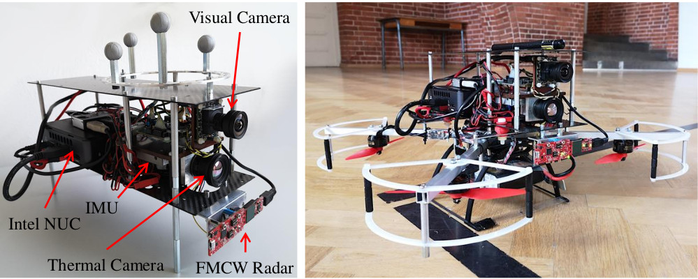

This dataset can be downloaded [here](https://bwsyncandshare.kit.edu/s/XaxE29Q262WDFWK) and can be processed by our RRxIO pipeline [RRxIO](https://github.com/christopherdoer/rrxio).

Further details regarding the datasets can be found in our [paper](../_publications/2021_09_IROS2021.md).

Contact me in case of questions or issues: [Christopher Doer](mailto:christopher.doer@kit.edu)

The dataset consists of 5 datasets recorded at a motion capture lab and 4 datasets recorded in typical scenes indoors and outdoors.
A short summary of the datasets is given below:

## Motion Capture Datasets
Ground truth is available and was created using [vicon2gt](https://github.com/rpng/vicon2gt) which does a batch optimization of the IMU and motion capture measurements to create the ground truth.

|Name |Trajectory Length  | Duration | Environment |
  --- | --- | --- | ---
|MoCap easy | 36m | 94s | Motion capture lab, low dynamic | 
|MoCap easy | 83m | 87s | Motion capture lab, medium dynamic | 
|MoCap easy | 70m | 86s | Motion capture lab, high dynamic | 
|MoCap dark | 111m | 135s | Motion capture lab, low dynamic, lights are switched of | 
|MoCap dark fast | 75m | 86s | Motion capture lab, medium dynamic, lights are switched of | 

## Pseudo Ground Truth Datasets
Pseudo ground truth is available and was created using [VINS](https://github.com/HKUST-Aerial-Robotics/VINS-Fusion)  with loops closure and subsequent manual removal of scale errors.

|Name |Trajectory Length  | Duration | Environment |
  --- | --- | --- | ---
|Gym | 74m | 84s | Two loops within a gym hall | 
|Indoor floor | 240m | 206s | Two loops in an office building | 
|Outdoor campus | 102m | 102s | Outdoors between two buildings | 
|Outdoor street | 264m | 186s | Street setting with cars, buildings and vegetation | 

# Cite
If you use this dataset for your academic research, please cite our related paper:
~~~bibtex
@INPROCEEDINGS{DoerIros2021,
  author={Doer, Christopher and Trommer, Gert F.},
  booktitle={2021 IEEE/RSJ International Conference on Intelligent Rotots and Sytems (IROS)}, 
  title={Radar Visual Inertial Odometry and Radar Thermal Inertial Odometry: Robust Navigation even in Challenging Visual Conditions}, 
  year={2021}}
}
~~~

# Known Issues
- The pseudo ground truth is not aligned as we logged the output of VINS here. Thus, alignment of the ground truth and estimated path is required for evaluation. Check the evaluation [script](https://github.com/christopherdoer/rrxio/blob/master/rrxio/python/evaluate_iros_datasets.py) used below for comprehensive evaluation.

# Sensor Setup
The sensor platform is equipped with an FMCW radar sensor (TI IWR6843AOP), a thermal camera (FLIR Boson 640), a monochrome visual camera (IDS UI-3241) and an IMU (Analog Devices ADIS16448). 
Accurate temporal synchronization of all sensor data is achieved using a micro-controller board. The sensor rates are: IMU (409 Hz), visual and thermal cameras (20 Hz) and radar (10 Hz).
The TI IWR6843AOP is a single chip 60 GHz Fast FMCW radar with an integrated antenna array (3 Tx and 4 Rx) and a Field of View (FOV) of approximately 60 ◦ in azimuth and elevation. All radar processing is done on chip. 
The visual camera uses a global shutter and provides images of 1280 × 1024 px. The thermal camera records with 640 × 512 px.

# Calibrations

The individual calibration files are:
- [Calibration visual camera](./irs_rtvi_datasets_iros2021/calib_visual_camera.yaml)
- [Calibration thermal camera](./irs_rtvi_datasets_iros2021/calib_thermal_camera.yaml)
- [Calibration radar sensor](./irs_rtvi_datasets_iros2021/calib_radar.yaml)

# Data Format
Each dataset consists of two files (details below):
- dataset_name.bag: Rosbag containing the sensor data
- dataset_name_gt.csv: Ground truth

## Rosbag
The sensor data is provided with rosbags containing the following topics:
- /sensor_platform/imu (sensor_msgs/Imu): IMU measurements (ADIS16448)
- /sensor_platform/camera_visual/img (sensor_msgs/Image): Images of visual camera (IDS UI-3241) 
- /sensor_platform/camera_thermal/img (sensor_msgs/Image): Images of thermal camera (FLIR Boson 640)
- /sensor_platform/baro (sensor_msgs/FluidPressure): Barometer measurements (ADIS16448) 
- /sensor_platform/radar/trigger (std_msgs/Header): Radar trigger, marks the start of a radar scan
- /sensor_platform/radar/scan (sensor_msgs/PointCloud2): Radar scan (IWR6843AOPEVM) whereas each point consists of: x
, y, z, snr_db , v_doppler_mps, noise_db and range. The time stamp is already in sync with the corresponding trigger header.

The point cloud point type is sketched below, for an example implementation see [radar_point_cloud.h](https://github.com/christopherdoer/reve/blob/master/radar_ego_velocity_estimator/include/radar_ego_velocity_estimator/radar_point_cloud.h) and [radar_point_cloud.cpp](https://github.com/christopherdoer/reve/blob/master/radar_ego_velocity_estimator/src/radar_point_cloud.cpp):

~~~c++
struct RadarPointCloudType
{
  PCL_ADD_POINT4D;      // position in [m]
  float snr_db;         // CFAR cell to side noise ratio in [dB]
  float v_doppler_mps;  // Doppler velocity in [m/s]
  float noise_db;       // CFAR noise level of the side of the detected cell in [dB]
  float range;          // range in [m]
  EIGEN_MAKE_ALIGNED_OPERATOR_NEW
} EIGEN_ALIGN16;
                                  
pcl::PointCloud<RadarPointCloudType> your_pcl;
~~~

## Pseudo Ground Truth
The pseudo ground truth is provided with csv files (separator: whitespace).   
The format is: timestamp p^w_x p^w_y p^w_z q^w_x q^w_y q^w_z q^w_w   
with the global position p^w and attitude quaternion q^w.    
This file format is compatible e.g. with [rpg_trajectory_evaluation](https://github.com/uzh-rpg
/rpg_trajectory_evaluation) for trajectory evaluation as done in our [paper](../_publications/2021_09_IROS2021.md).

# Evaluation Result of Doer et.al. IROS 2021
The evaluation result using the approach of our related [paper](../_publications/2021_09_IROS2021.md) is also included in this dataset. These results can be created using a single [script](https://github.com/christopherdoer/rrxio/blob/master/rrxio/python/evaluate_iros_datasets.py) resulting in the analysis below:

~~~
rosrun rrxio evaluate_iros_datasets.py <path-to-rtvi_datastets_iros_2021>
~~~

## MoCap Datasets

## Pseudo Ground Truth Datasets

## Average Realtime Factors

