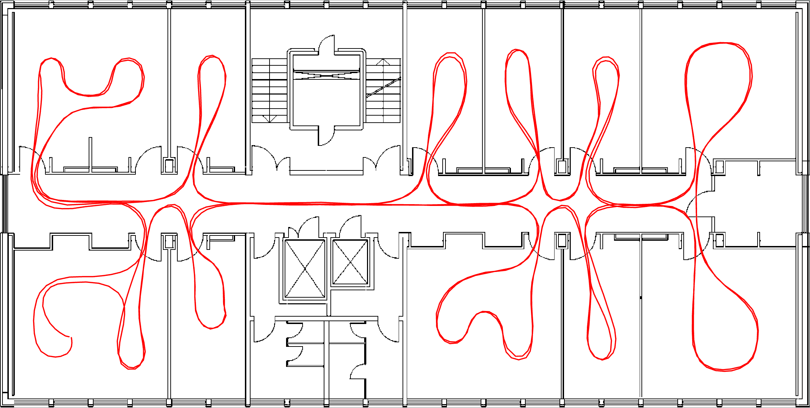
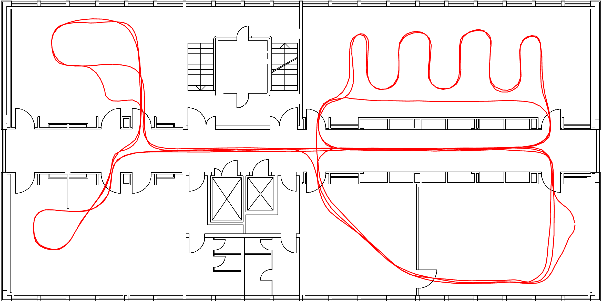
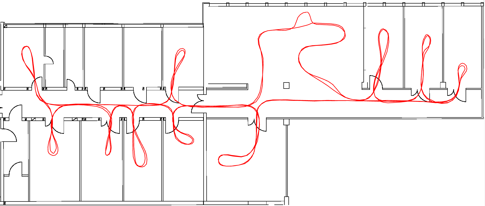
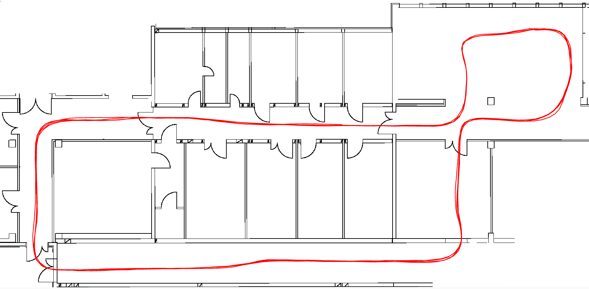

This dataset can be downloaded [here](https://drive.google.com/file/d/1zq9g0S9Rn6jrlmgwsmzBNgnSFr-m9NqL/view?usp=sharing) and can be processed by our Radar Inertial Odometry pipeline [x_rio](https://github.com/christopherdoer/rio/tree/main/x_rio).

Contact me in case of questions or issues: [Christopher Doer](mailto:christopherdoer@gmail.com)

# Cite
If you use this dataset for your academic research, please cite our related paper:
~~~bibtex
@INPROCEEDINGS{DoerJGN2022,
author = {Doer, Christopher and Trommer, Gert F.},
year = {2022},
month = {02},
pages = {329-339},
title = {x-RIO: Radar Inertial Odometry with Multiple Radar Sensors and Yaw Aiding},
volume = {12},
journal = {Gyroscopy and Navigation},
}
~~~

# ToDO
More documentation will follow soon!

# Datasets with Pseudo Groundtruth and Groundplans
### Office Floor 

### Lab Floor 

### Workshop

### Basement
