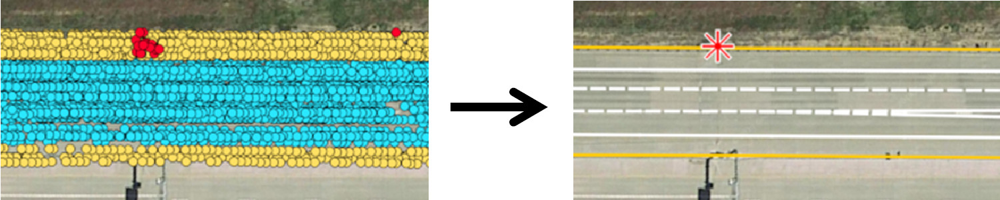

My name is Christopher Doer and I am a research associate and PhD candidate at the Institute of Control Systems (IRS), Karlsruhe Institute of
 Technology (KIT) supervised by Prof. Gert F. Trommer. 
 Before that, I obtained my B.Sc. and M.Sc. in Electrical Engineering at KIT.
 During my studies I gained further experience doing several internships and research assistant jobs in Germany and
  the  USA.
I am interested in autonomous aerial vehicles (e.g. drones or VTOLs) enabling applications such as urban air mobility, parcel delivery, search and rescue, surveillance and maintenance.

# Research
My main research focus is the robust and reliable navigation of aerial vehicles even in challenging visual conditions such as darkness or fog and in GNSS degraded or GNSS denied environments.
I am working on multi domain approaches with FMCW radar, thermal imaging and inertial sensing. I demonstrated these approaches for takeoff and precision landing and online navigation of autonomous drones successfully even in degraded visual conditions. 

# Recent News
- 03/2022: Our Journal paper [x-RIO: Radar Inertial Odometry with Multiple Radar Sensors and Yaw Aiding](../_publications/2022_02_JGN2022.md) is published. The code is released as open source: [x_rio](https://github.com/christopherdoer/rio/tree/main/x_rio). The [datasets](../_datasets/multi_radar_inertial_datasets_JGN2022.md) with ground truth are also available.
   
- 09/2021: Check out our IROS 2021 [paper](../_publications/2021_09_IROS2021.md) on [RRxIO](https://github.com/christopherdoer/rrxio) combining radar ego velocity estimates with Visual Inertial Odometry (VIO) or Thermal Inertial Odometry (TIO). The code is released as open source: [RRxIO](https://github.com/christopherdoer/rrxio). The [radar-thermal-visual-inertial datasets](../_datasets/irs_rtvi_datasets_iros2021.md) with ground truth are also available.
   
- 09/2021: [REVE - Radar Ego Velocity Estimator](https://github.com/christopherdoer/reve): Robust 3D ego velocity estimation using 4D mmWave radar sensors is released as open source.
- 06/2021: The radar inertial datasets with pseudo ground truth used in our recent paper on [Yaw aided Radar Inertial Odometry](../_publications/2021_05_ICINS2021.md) are available [here](../_datasets/icins_2021_radar_inertial_odometry.md).
- 05/2021: RIO - Radar Inertial Odometry and Radar based Ego Velocity Estimation is released as open source [here](https://github.com/christopherdoer/rio).
   
    
   
   
# Projects
### [Radar Inertial Odometry](../_projects/radar_inertial_odometry.md)   
Robust accurate and highly efficient navigation even in degraded visual and GNSS degraded or denied environments using FMCW radar sensors and inertial sensing which can be used for any type of mobile robot. [[Code]](https://github.com/christopherdoer/rio)

### [Precision Takeoff and Landing](../_projects/precision_takeoff_landing.md)   
Precision Takeoff and Landing even in challenging visual conditions such as darkness, fog or smoke enabling robust autonomous UAS operation. 

 

   
# Publications 
### [GNSS aided Radar Inertial Odometry for UAS Flights in Challenging Conditions ](../_publications/2022_02_Aeroconf2022.md)  
Christopher Doer, Jamal Atman and Gert F. Trommer   
2022 IEEE Aerospace Conference (AeroConf)   
[[Details]](../_publications/2022_02_Aeroconf2022.md) 
[[Paper Draft]](https://bwsyncandshare.kit.edu/s/ikWes8nJppCS59K)
[[Code will follow soon]](https://github.com/christopherdoer/rio)
[[Datasets will follow soon]](./datasets.md)   
 

### [x-RIO: Radar Inertial Odometry with Multiple Radar Sensors and Yaw Aiding](../_publications/2022_02_JGN2022.md)  
Christopher Doer and Gert F. Trommer   
Journal Gyroscopy and Navigation 2022    
[[Details]](../_publications/2022_02_JGN2022.md) 
[[Paper]](https://link.springer.com/article/10.1134/S2075108721040039)
[[Code]](https://github.com/christopherdoer/rio/tree/main/x_rio)
[[Datasets]](../_datasets/multi_radar_inertial_datasets_JGN2022.md)  
 

### [Radar Visual Inertial Odometry and Radar Thermal Inertial Odometry: Robust Navigation even in Challenging Visual Conditions](../_publications/2021_09_IROS2021.md)  
Christopher Doer and Gert F. Trommer   
2021 IEEE/RSJ International Conference on Intelligent Robots and Systems (IROS 2021)   
[[Details]](../_publications/2021_09_IROS2021.md) 
[[Paper]](https://ieeexplore.ieee.org/document/9636799)
[[Code]](https://github.com/christopherdoer/rrxio)
[[Datasets]](../_datasets/irs_rtvi_datasets_iros2021.md)   
 

### [Yaw aided Radar Inertial Odometry using Manhattan World Assumptions](../_publications/2021_05_ICINS2021.md)  
Christopher Doer and Gert F. Trommer   
28th Saint Petersburg International Conference on Integrated Navigation Systems (ICINS), 2021     
[[Details]](../_publications/2021_05_ICINS2021.md) 
[[Paper]](https://ieeexplore.ieee.org/document/9470842)
[[Code]](https://github.com/christopherdoer/rio)
[[Datasets]](../_datasets/icins_2021_radar_inertial_odometry.md)
[[Video_1]](https://www.youtube.com/watch?v=EIcBMo1sM_g) 
[[Video_2]](https://www.youtube.com/watch?v=KhWPqMC6gSE)   
 

### [Radar Inertial Odometry with Online Calibration](../_publications/2020_10_ENC2020.md)  
Christopher Doer and Gert F. Trommer   
European Navigation Conference (ENC), 2020   
[[Details]](../_publications/2020_10_ENC2020.md) 
[[Paper]](https://ieeexplore.ieee.org/document/9317343) 
[[Video]](https://www.youtube.com/watch?v=8DofG1iXHAE)
[[Code]](https://github.com/christopherdoer/rio)   
 

### [HD Map Generation from Vehicle Fleet Data for Highly Automated Driving on Highways](../_publications/2020_11_IV2020.md)   
Christopher Doer, Michael Henzler, Heiner Messner and Gert F. Trommer   
IEEE Intelligent Vehicles Symposium (IV), 2020   
[[Details]](../_publications/2020_11_IV2020.md)
[[Paper]](https://ieeexplore.ieee.org/document/9304781)    
 

### [Autonomous Precision Takeoff and Landing System for VTOLs in Degraded Visual and GNSS Denied Environments](../_publications/2020_09_DLRK2020.md)   
Christopher Doer, Ronja Koenig, Eige Stumpf and Gert F. Trommer      
Deutsche Gesellschaft für Luft- und Raumfahrt - Lilienthal-Oberth e.V., Bonn, 2020   
[[Details]](../_publications/2020_09_DLRK2020.md)
[[Paper]](https://www.dglr.de/publikationen/2020/530121.pdf)     
 

### [An EKF Based Approach to Radar Inertial Odometry](../_publications/2020_09_MFI2020.md)   
Christopher Doer and Gert F. Trommer   
IEEE International Conference on Multisensor Fusion and Integration for Intelligent Systems, 2020   
[[Details]](../_publications/2020_09_MFI2020.md) 
[[Paper]](https://ieeexplore.ieee.org/document/9235254)
[[Code]](https://github.com/christopherdoer/rio)    
 

### [Radar Based Autonomous Precision Takeoff and Landing System for VTOLs in GNSS Denied Environments](../_publications/2020_09_ICUAS2020.md)   
Christopher Doer, Ronja Koenig, Eike Stumpf and Gert F. Trommer   
International Conference on Unmanned Aircraft Systems (ICUAS), 2020   
[[Details]](../_publications/2020_09_ICUAS2020.md)
[[Paper]](https://ieeexplore.ieee.org/document/9213925)   
 

### [Inertial Sensor Data based Motion Estimation aided by Image Processing and Differential Barometry](../_publications/2018_05_ICINS2018.md)
Christopher Doer, Georg Scholz, Jan Ruppelt and Gert F. Trommer   
25th Saint Petersburg International Conference on Integrated Navigation Systems (ICINS), 2018   
[[Details]](../_publications/2018_05_ICINS2018.md)
[[Paper]](https://ieeexplore.ieee.org/document/8405839)    
 

### [Indoor Laser-based SLAM for Micro Aerial Vehicles](../_publications/2017_08_JGN.md)   
Christopher Doer, Georg Scholz and Gert F. Trommer   
Journal Gyroscopy and Navigation, 2017   
[[Details]](../_publications/2017_08_JGN.md)
[[Paper]](https://link.springer.com/article/10.1134/S2075108717030038)    

 
# Datasets 
### [Multi Radar Inertial Datasets JGN 2022](../_datasets/multi_radar_inertial_datasets_JGN2022.md)   
Multi Radar Inertial indoor datasets with pseudo ground truth 

### [IRS RTVI Datasets IROS 2021](../_datasets/irs_rtvi_datasets_iros2021.md)   
Radar Thermal Visual Inertial datasets with ground truth in good and in challenging visual conditions.

### [Radar Inertial Datasets ICINS 2021](../_datasets/icins_2021_radar_inertial_odometry.md)   
Radar Inertial indoor datasets with pseudo ground truth: 5 carried (left) and 4 manual flight (right) datasets    
