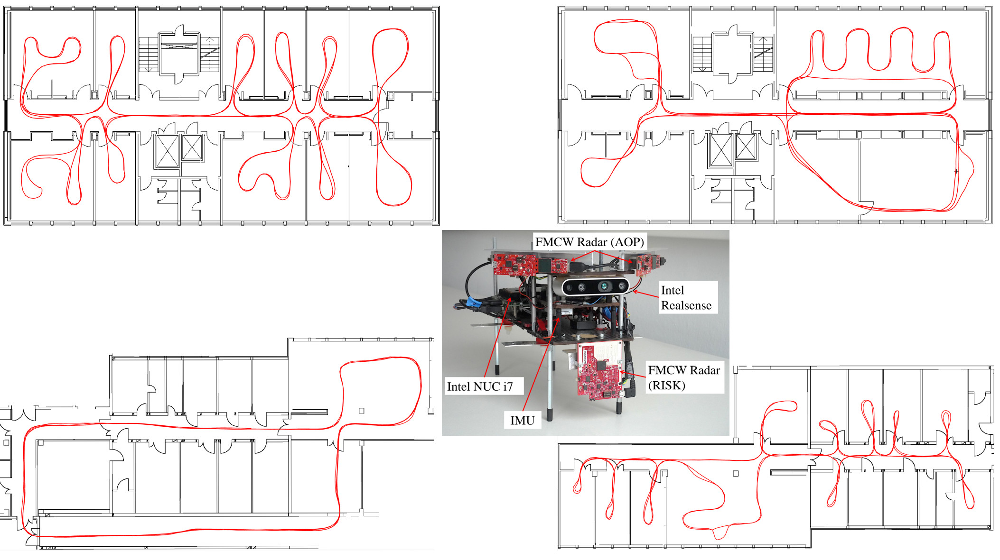
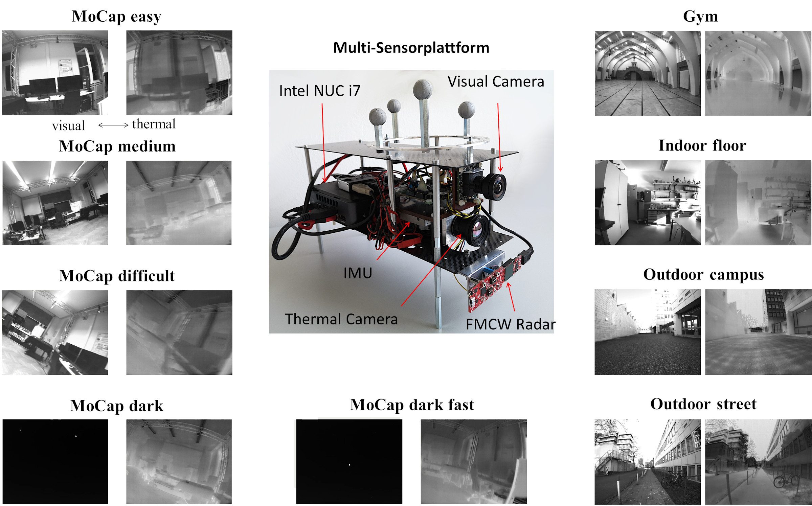

### [Multi Radar Inertial Datasets JGN 2022](../_datasets/multi_radar_inertial_datasets_JGN2022.md)   
Multi Radar Inertial indoor datasets with pseudo ground truth 

### [IRS RTVI Datasets IROS 2021](../_datasets/irs_rtvi_datasets_iros2021.md)   
Radar Thermal Visual Inertial datasets with ground truth in good and in challenging visual conditions.

### [Radar Inertial Datasets ICINS 2021](../_datasets/icins_2021_radar_inertial_odometry.md)   
Radar Inertial indoor datasets with pseudo ground truth: 5 carried (left) and 4 manual flight (right) datasets    

