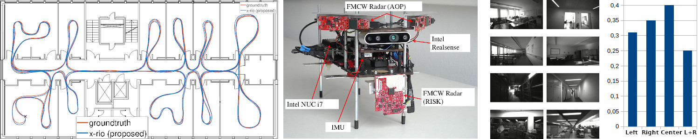
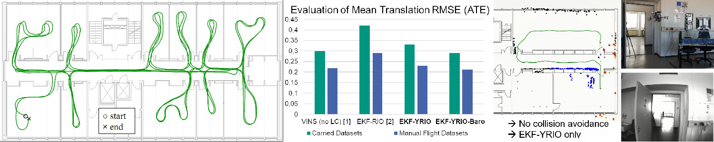
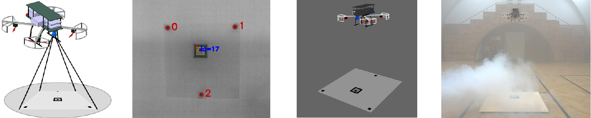
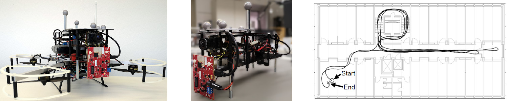
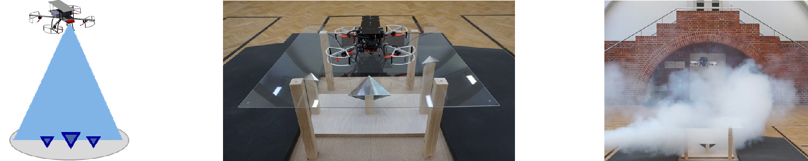

## [GNSS aided Radar Inertial Odometry for UAS Flights in Challenging Conditions ](../_publications/2022_02_Aeroconf2022.md)  
Christopher Doer, Jamal Atman and Gert F. Trommer   
2022 IEEE Aerospace Conference (AeroConf)   
[[Details]](../_publications/2022_02_AeroConf2022.md) 
[[Paper Draft will follow soon]]()
[[Code will follow soon]](https://github.com/christopherdoer/rio)
[[Datasets will follow soon]](../_datasets/)   
 

## [x-RIO: Radar Inertial Odometry with Multiple Radar Sensors and Yaw Aiding](../_publications/2022_02_JGN2022.md)  
Christopher Doer and Gert F. Trommer   
Journal Gyroscopy and Navigation 2022    
[[Details]](../_publications/2022_02_JGN2022.md) 
[[Paper]](https://link.springer.com/article/10.1134/S2075108721040039)
[[Code]](https://github.com/christopherdoer/rio/tree/main/x_rio)
[[Datasets]](../_datasets/multi_radar_inertial_datasets_JGN2022.md)  
 

## [Radar Visual Inertial Odometry and Radar Thermal Inertial Odometry: Robust Navigation even in Challenging Visual Conditions](../_publications/2021_09_IROS2021.md)  
Christopher Doer and Gert F. Trommer   
2021 IEEE/RSJ International Conference on Intelligent Robots and Systems (IROS 2021)   
[[Details]](../_publications/2021_09_IROS2021.md) 
[[Paper]](https://ieeexplore.ieee.org/document/9636799)
[[Code]](https://github.com/christopherdoer/rrxio)
[[Datasets]](../_datasets/irs_rtvi_datasets_iros2021.md)   
 

## [Yaw aided Radar Inertial Odometry using Manhattan World Assumptions](../_publications/2021_05_ICINS2021.md)  
Christopher Doer and Gert F. Trommer   
28th Saint Petersburg International Conference on Integrated Navigation Systems (ICINS), 2021     
[[Details]](../_publications/2021_05_ICINS2021.md) 
[[Paper]](https://ieeexplore.ieee.org/document/9470842)
[[Code]](https://github.com/christopherdoer/rio)
[[Datasets]](../_datasets/icins_2021_radar_inertial_odometry.md)
[[Video_1]](https://www.youtube.com/watch?v=EIcBMo1sM_g) 
[[Video_2]](https://www.youtube.com/watch?v=KhWPqMC6gSE)   
 

## [Radar Inertial Odometry with Online Calibration](../_publications/2020_10_ENC2020.md)  
Christopher Doer and Gert F. Trommer   
European Navigation Conference (ENC), 2020   
[[Details]](../_publications/2020_10_ENC2020.md) 
[[Paper]](https://ieeexplore.ieee.org/document/9317343) 
[[Video]](https://www.youtube.com/watch?v=8DofG1iXHAE)
[[Code]](https://github.com/christopherdoer/rio)   
 

## [HD Map Generation from Vehicle Fleet Data for Highly Automated Driving on Highways](../_publications/2020_11_IV2020.md)   
Christopher Doer, Michael Henzler, Heiner Messner and Gert F. Trommer   
IEEE Intelligent Vehicles Symposium (IV), 2020   
[[Details]](../_publications/2020_11_IV2020.md)
[[Paper]](https://ieeexplore.ieee.org/document/9304781)    
 

## [Autonomous Precision Takeoff and Landing System for VTOLs in Degraded Visual and GNSS Denied Environments](../_publications/2020_09_DLRK2020.md)   
Christopher Doer, Ronja Koenig, Eige Stumpf and Gert F. Trommer      
Deutsche Gesellschaft für Luft- und Raumfahrt - Lilienthal-Oberth e.V., Bonn, 2020   
[[Details]](../_publications/2020_09_DLRK2020.md)
[[Paper]](https://www.dglr.de/publikationen/2020/530121.pdf)     
 

## [An EKF Based Approach to Radar Inertial Odometry](../_publications/2020_09_MFI2020.md)   
Christopher Doer and Gert F. Trommer   
IEEE International Conference on Multisensor Fusion and Integration for Intelligent Systems, 2020   
[[Details]](../_publications/2020_09_MFI2020.md) 
[[Paper]](https://ieeexplore.ieee.org/document/9235254)
[[Code]](https://github.com/christopherdoer/rio)    
 

## [Radar Based Autonomous Precision Takeoff and Landing System for VTOLs in GNSS Denied Environments](../_publications/2020_09_ICUAS2020.md)   
Christopher Doer, Ronja Koenig, Eike Stumpf and Gert F. Trommer   
International Conference on Unmanned Aircraft Systems (ICUAS), 2020   
[[Details]](../_publications/2020_09_ICUAS2020.md)
[[Paper]](https://ieeexplore.ieee.org/document/9213925)   
 

## [Inertial Sensor Data based Motion Estimation aided by Image Processing and Differential Barometry](../_publications/2018_05_ICINS2018.md)
Christopher Doer, Georg Scholz, Jan Ruppelt and Gert F. Trommer   
25th Saint Petersburg International Conference on Integrated Navigation Systems (ICINS), 2018   
[[Details]](../_publications/2018_05_ICINS2018.md)
[[Paper]](https://ieeexplore.ieee.org/document/8405839)    
 

## [Indoor Laser-based SLAM for Micro Aerial Vehicles](../_publications/2017_08_JGN.md)   
Christopher Doer, Georg Scholz and Gert F. Trommer   
Journal Gyroscopy and Navigation, 2017   
[[Details]](../_publications/2017_08_JGN.md)
[[Paper]](https://link.springer.com/article/10.1134/S2075108717030038)    

