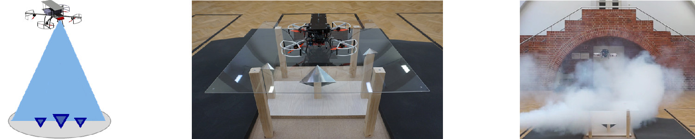

Christopher Doer, Ronja Koenig, Eike Stumpf and Gert F. Trommer   
International Conference on Unmanned Aircraft Systems (ICUAS), 2020   
[[Paper]](https://ieeexplore.ieee.org/document/9213925)

## Abstract 
Current research on Vertical Takeoff and Landing Vehicles (VTOLs) like urban air mobility, parcel delivery, search and rescue or human aid require precise autonomous takeoff and landing systems. 
Safe and reliable flight operations have to be ensured even for challenging conditions like fog, night or direct sunlight. 
In addition, robust, low-cost and low-maintenance infrastructure is required. 
Since using the Global Navigation Satellite System (GNSS) is not reliable in particular close to landing areas due to multi path errors or jamming, an GNSS denied navigation technique is required.
This paper presents a radar based autonomous takeoff and landing system for VTOLs. 
The localization system requires only passive radar reflectors on the ground. 
A standard automotive radar, as used for driver assistance systems, is applied for detection. Fusion with an Inertial Measurement Unit (IMU) further improves the localization accuracy. 
A dedicated landing platform is developed along with a flight guidance such that autonomous precision takeoff and landing can be conducted. 
Our system has been tested in extensive flight experiments. 
Indoor flight experiments proved the overall system performance even with bad visual conditions which we simulated with a fog machine. 
The system achieved a high localization accuracy with a mean absolute error below 0.1 m. 
All test flights resulted in a successful landing in the center of our landing platform.

 

## Cite
~~~bibtex
@INPROCEEDINGS{DoerICUAS2020,
  author={Doer, Christopher and Koenig, Ronja and Trommer, Gert F. and Stumpf, Eike},
  booktitle={2020 International Conference on Unmanned Aircraft Systems (ICUAS)}, 
  title={Radar Based Autonomous Precision Takeoff and Landing System for VTOLs in GNSS Denied Environments}, 
  year={2020},
  volume={},
  number={},
  pages={922-931},
  doi={10.1109/ICUAS48674.2020.9213925}}
~~~