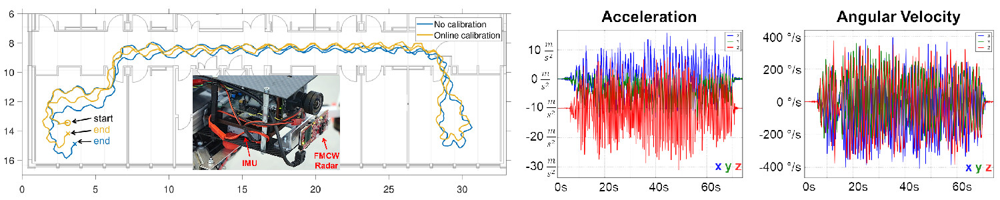

Christopher Doer and Gert F. Trommer   
European Navigation Conference (ENC), 2020   
[[Paper]](https://ieeexplore.ieee.org/document/9317343) 
[[Video]](https://www.youtube.com/watch?v=8DofG1iXHAE)
[[Code]](https://github.com/christopherdoer/rio)

## Abstract 
Accurate localization in visually degraded and GNSS denied environments is key for autonomous robotics. Vision based approaches usually fail in challenging conditions like smoke, dusk, direct sunlight or darkness. 
Our approach uses an Inertial Measurement Unit (IMU) and a millimeter wave FMCW radar sensor as both sensors are not affected by such conditions. 
A filter based 3D Radar Inertial Odometry (RIO) approach is presented which enables the online estimation of the extrinsic calibration of the radar sensor. 
Consequently, tedious calibration is not required any more. 
The application of stochastic cloning enables to process delayed radar measurements properly which enables to apply the navigation filter for online navigation. 
The proposed system is evaluated in simulation which proves a consistent estimation. 
Real world experiments with carried datasets and UAV flights prove the improvement by online calibration resulting in reduced position errors.

 

## Demo Video: Autonomous Indoor Flights

## Cite
~~~bibtex
@INPROCEEDINGS{DoerENC2020,
  author={Doer, Christopher and Trommer, Gert F.},
  booktitle={2020 European Navigation Conference (ENC)}, 
  title={Radar Inertial Odometry With Online Calibration}, 
  year={2020},
  pages={1-10},
  doi={10.23919/ENC48637.2020.9317343}}
~~~