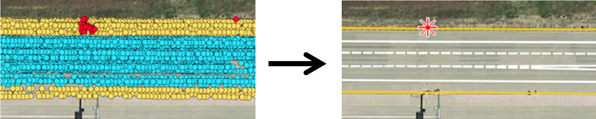

Christopher Doer, Michael Henzler, Heiner Messner and Gert F. Trommer   
IEEE Intelligent Vehicles Symposium (IV), 2020   
[[Paper]](https://ieeexplore.ieee.org/document/9304781)

## Abstract 
In this paper we propose an iterative Graph SLAM based approach to create HD maps from series production vehicles fleet data. 
Only high level sensor measurements provided by advanced driver assistance systems are used. 
This reduces the required bandwidth and makes this approach scalable to vehicle fleet data. 
Creating HD maps from fleet data enables up to date HD maps since no dedicated mapping vehicles are required. 
At first, the data is aligned based on odometry, GNSS and traffic sign measurements. 
Next, road boundary measurements are included, which results in an optimized lateral alignment. 
Finally, lane boundary association can be carried out. 
This results in an HD map containing high accuracy data of traffic signs, road and lane boundaries. 
The approach was evaluated using series production vehicle fleet data recorded on US highways and on a German autobahn covering a distance of 35.4km. 
The final HD map was evaluated with a groundtruth HD map and achieved an average error of 0.59m. 

 

## Cite
~~~bibtex
@INPROCEEDINGS{DoerIV2020,
  author={Doer, Christopher and Henzler, Michael and Messner, Heiner and Trommer, Gert F.},
  booktitle={2020 IEEE Intelligent Vehicles Symposium (IV)}, 
  title={HD Map Generation from Vehicle Fleet Data for Highly Automated Driving on Highways}, 
  year={2020},
  pages={2014-2020},
  doi={10.1109/IV47402.2020.9304781}}
~~~